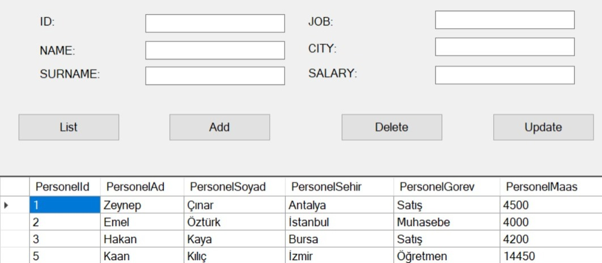
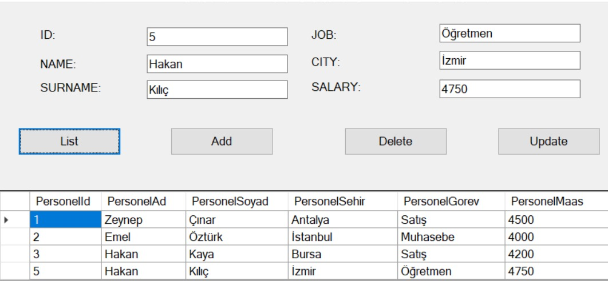

# Murat Yücedağ Udemy Course Section Project 
## N-Tier-Architecture

<h3>Project Explanation</h3>
- This project is an n-layer architectural exercise project. We used MSSQL database for the project. 
- We have 4 layers within the scope of the project. These are; 
1- Entity Layer 
2- Data Access Layer 
3-Logic Layer 
4-Presentation Layer 
- We made a Crud operations project by establishing inter-layer communication.

<h3>Language and Tools</h3>

  
  
  

 
  
   
  
   
